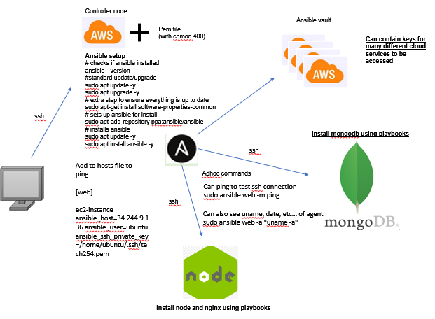
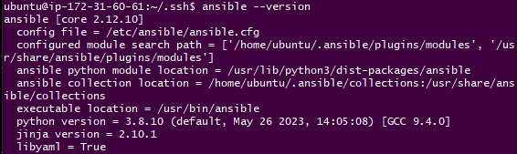

# Why use ansible?

Ansible is a powerful tool that allows you to connect to, and control many different instances at once and execute an automated list of commands using something called playbooks.

It is obvious why this is useful, not only can it be used to automate changes to config files/packages/files/etc, it also has the ability to do this to an entire web of servers automatically by reading a list of IPs from it's host file.

It has a range of other powerful uses, shown in the diagram below that illustrates the structure of an Ansible system.



# Setting up Ansible

This is a step by step process for setting up Ansible.

In this example we will be using an EC2 instance running ansible as the controller, an instance running node and a third instance with the database.

Setup steps for ansible:

1. Connect to your EC2 instance

2. Input the following commands...
```
# checks if ansible installed
ansible --version

#standard update/upgrade
sudo apt update -y
sudo apt upgrade -y

# extra step to ensure everything is up to date
sudo apt-get install software-properties-common

# sets up ansible for install
sudo apt-add-repository ppa:ansible/ansible

# installs ansible
sudo apt update -y
sudo apt install ansible -y
```

3. Open another git bash and type `scp -i "~/.ssh/tech254.pem" ~/.ssh/tech254.pem ubuntu@<instance IP>:~/.ssh` (change to include the IP of your instance) to provide Ansible with the AWS pem file so it can SSH into instances

4. Optional step to install tree (just makes working with files easier) `sudo apt install tree -y`

5. Check Ansible version with `ansible --version` and we should see something like this, confirming the install was successful!



6. Repeating this process with 2 other instances should give us the following...

