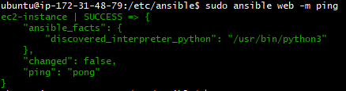

# Why use ansible?

Ansible is a powerful tool that allows you to connect to, and control many different instances at once and execute an automated list of commands using something called playbooks.

It is obvious why this is useful, not only can it be used to automate changes to config files/packages/files/etc, it also has the ability to do this to an entire web of servers automatically by reading a list of IPs from it's host file.

It has a range of other powerful uses, shown in the diagram below that illustrates the structure of an Ansible system.


# Setting up Ansible

This is a step by step process for setting up Ansible.

In this example we will be using an EC2 instance running ansible as the controller, an instance running node and a third instance with the database.

Setup steps for ansible:

1. Connect to your EC2 instance

2. Input the following commands...
```
# checks if ansible installed
ansible --version

#standard update/upgrade
sudo apt update -y
sudo apt upgrade -y

# extra step to ensure everything is up to date
sudo apt-get install software-properties-common

# sets up ansible for install
sudo apt-add-repository ppa:ansible/ansible

# installs ansible
sudo apt update -y
sudo apt install ansible -y
```

3. Open another git bash and type `scp -i "~/.ssh/tech254.pem" ~/.ssh/tech254.pem ubuntu@<instance IP>:~/.ssh` (change to include the IP of your instance) to provide Ansible with the AWS pem file so it can SSH into instances

4. Optional step to install tree (just makes working with files easier) `sudo apt install tree -y`

5. Check Ansible version with `ansible --version` and we should see something like this, confirming the install was successful!


# Connecting with ansible

Can connect to other instances while IN the ansible instance by using standard ssh commands, referencing the .pem file.

1. We need to provide info about our agents in the hosts file.

`sudo nano hosts`

2. Can add IP for who you want to ping in hosts.

```
[web]

ec2-instance ansible_host=<IP> ansible_user=ubuntu ansible_ssh_private_key_fule=ubuntu/home/.ssh/<pem file>
```

- `ec2-instance ansible_host` denotes the IP

- `ansible_user=ubuntu` denotes the user we want to ssh as (eg. ubuntu rather than root)

- `ansible_ssh_private_key_file` denotes the location of the private key we need for ssh connections

3. To test our connection we can ping our agent instance with `sudo ansible web -m ping`which returns an error if hosts not setup correctly.

We should see something like this if the ping was successful



- Can also see uname, date, etc… of agent `sudo ansible web -a "uname -a"`

These short ansible commands like ping and the uname one are called **adhocs**.

The main advantage to these are that they are short, simple commands that execute tasks used for testing/examining things and would therefore be inappropriate for a playbook, something we will talk about next.

Using an example, say if you wanted to power on all instances in Japan at 8am their time, you could use `sudo ansible web -a "uname -a"` to check the name of the japanese server, then `sudo ansible web -a "date"` to check it's date/time.

# Playbooks

These are a way to automate commands on the agents. Functionally Ansible scripts that will execute list of commands sequentially on the agent node.

These are written in yaml and are a large reason why Ansible is so effective for automation.

**REMEMBER! Indentations in yaml use TWO SPACES not tab!**

An example of how you make these playbooks (playbook to install nginx)...

1. `sudo nano install-nginx.yml` lets you create a playbook file with nano

2. Then we can setup the steps for what we want to do with pseudocode
```
# To create playbook to provision nginx web server in webnode
# Starts with 3 dashes
# Where to run/install?
# provide logs
# provide admin to this playbook
#instructions: install nginx
#ensure nginx is enabled
```

3. Then write the commands out
```
# To create playbook to provision nginx web server in webnode
---
# Starts with 3 dashes
# Where to run/install?
- hosts: web

# provide logs
  gather_facts: yes

# provide admin to this playbook
  become: true

#instructions: install nginx
  tasks:
  - name: provision nginx
    apt: pkg=nginx state=present

#ensure nginx is enabled
```
- yaml files require `---` at the start so the system knows to treat these as yaml files

Blocker: If you get error `E:Malformed entry` then delete the offending file (it will be named in the error) on the agent.

Playbook to do this:
```
---
- hosts: web
  gather_facts: yes
  become: true
  tasks:
  - name: Delete content & directory
    ansible.builtin.file:
      state: absent
      path: <path for offending file>
```

# Other useful playbooks

Update/upgrade:
```
---
- hosts: web
  gather_facts: yes
  become: true
  tasks:
  - name: Update/upgrade
    apt:
      upgrade: yes
      update_cache: yes
```

Install nodeJS:
```
---
- hosts: web
  gather_facts: yes
  become: true
  tasks:
  - name: Get key
    apt_key:
      url: https://deb.nodesource.com/gpgkey/nodesource.gpg.key
      state: present
  - name: Add nodejs v12
    apt_repository:
      repo: deb https://deb.nodesource.com/node_12.x bionic main
      update_cache: yes
  - name: install nodejs
    apt: update_cache=yes state=present
```
