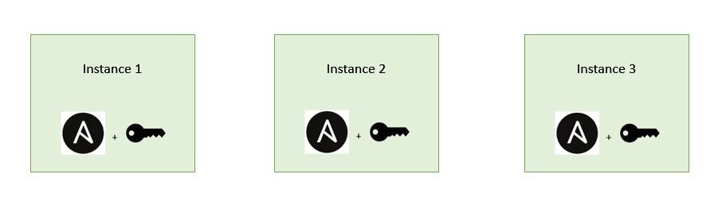

# Setting up Ansible

This is a step by step process for setting up Ansible.

1. Connect to your EC2 instance

2. Input the following commands...
```
# checks if ansible installed
ansible --version

#standard update/upgrade
sudo apt update -y
sudo apt upgrade -y

# extra step to ensure everything is up to date
sudo apt-get install software-properties-common

# sets up ansible for install
sudo apt-add-repository ppa:ansible/ansible

# installs ansible
sudo apt update -y
sudo apt install ansible -y
```

3. Open another git bash and type `scp -i "~/.ssh/tech254.pem" ~/.ssh/tech254.pem ubuntu@<instance IP>:~/.ssh` (change to include the IP of your instance) to provide Ansible with the AWS pem file so it can SSH into instances

4. Optional step to install tree (just makes working with files easier) `sudo apt install tree -y`

5. Check Ansible version with `ansible --version` and we should see something like this, confirming the install was successful!


6. Make sure the user has access to the pem file too with `sudo chmod 400 file.pem`.

7. Repeating this process with 2 other instances should give us the following...



We can repeat this process to make any number of Ansible instances!
