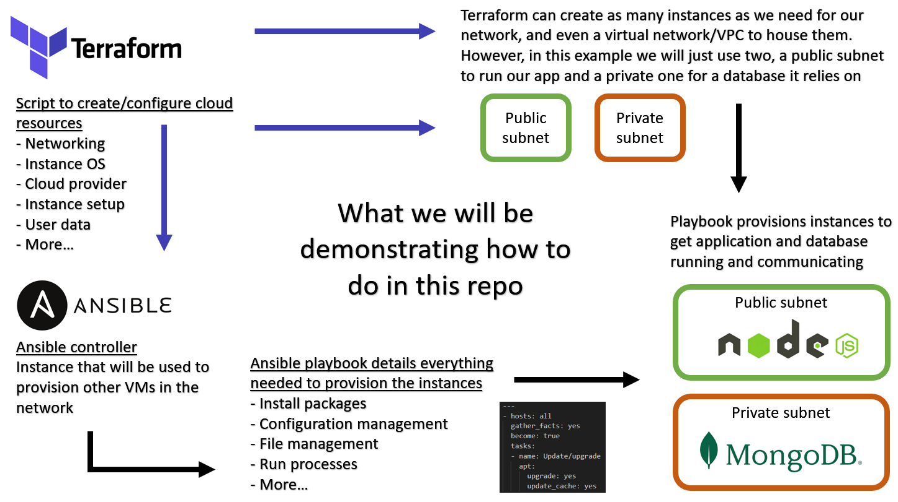

# Repo for Infrastructure as Code (IaC)

## Table of contents:

1. [What is Infrastructure as Code](#what-is-infrastructure-as-code)

2. [What is configuration management](#what-is-configuration-management)

3. [What is orchestration](#what-is-orchestration)

4. [Advantages of IaC](#advantages-of-iac)

5. [Links to Ansible and Terraform markdowns](#for-a-more-in-depth-looks-at-specific-tools-follow-the-links-below)

# What is Infrastructure as Code

**Definition**: The process of managing and provisioning infrastructure using code instead of doing it manually.

In simplier terms, this essentially means **any processes in setting up and provisioning instances that would otherwise have been done manually can be done automatically**. This even allows you to provision, configure and update an entire network of instances automatically and all in the same way, ensuring consistancy and reducing room for human error. This is obviously extremely powerful.

IaC can automate processess such as:
1. Creating virtual machines on the cloud
- Including any configuration such as security groups and others
2. Provisioning these virtual machines
3. Altering configuration files and other file management
4. And more!

We can essentially automate the entire resource creation and provisioning process using IaC.

# What is configuration management

**Definition**: The process in which systems are monitored and maintained through automated processes.

Practially, this means using tools to update/configure virtual machines using tools such as Ansible to make sure a network of instances are up and running properly.

Ansible in particular is extremely useful for this as it allows the process to be part of an automation pipeline to speed things up.

# What is orchestration

**Definition**: Aspect of IaC that focusses on managing and coordinating deployment automatically in multiple different systems at once. 

This is typically done with Terraform, though other tools are available. Terraform allows us to define the resources we want to create in a script, then run this to automatically create the instances to our specifications.

# Advantages of IaC

1. Maintain consistancy between instances, as a single script is used to configure or provision many different instances in the same way.

2. Lower chance for human error, as you're not manually creating resources over and over, and additionally the scripts, if well commented, are much easier to check for errors than manual deployment of resources.

3. Faster at deploying and updating instances, as one singular script can be used to deploy a fleet of instances, and change their configuration too.

4. **Financial benefits!** As the process of deploying instances is much faster, less paid employee time is spent on it and can be used on other projects.

# For a more in depth looks at specific tools follow the links below.

 [Using **Ansible** for IaC](ansible/ansible.md)

 [Orchestration with **Terraform**](Terraform/terraform.md)
