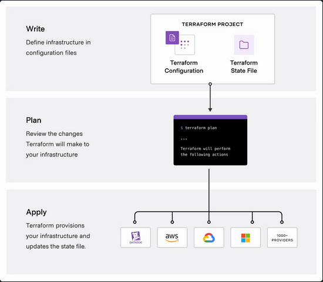
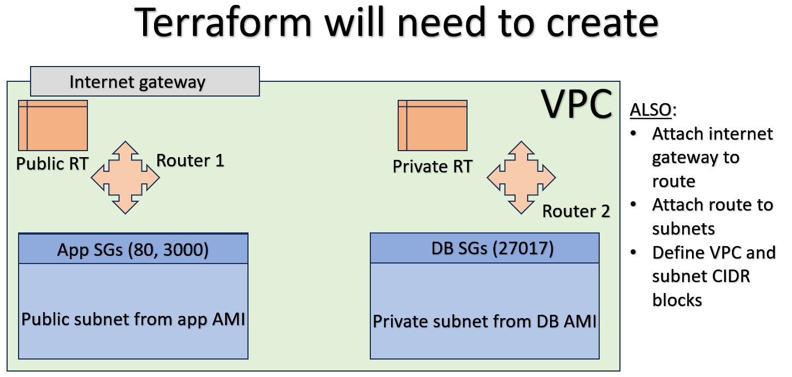

# Terraform

## Table of contents:

1. [Why use orchestration with Terraform](#why-use-orchestration-with-terraform)

2. [How to do orchestration with Terraform](#how-to-do-orchestration-with-terraform)

3. [How and why use a variable.tf file](#using-variabletf)

4. [Setting up a VPC with Terraform](#setting-up-a-vpc-with-terraform)

Additional resources:

[Link to main.tf used to create a VPC](tech254-terraform/main.tf)

[Link to example user data that could be used in Terraform to provision a newly created database instance](tech254-terraform/provision.sh)

# Why use orchestration with Terraform

Orchestration is essentially the practice of coordinating many processes in development at the same time. In the context of cloud infrastructure, this allows us to run a single script to deploy as many components of our infrastructure as we need, to defined specifcations, saving significant time that would be otherwise spent doing this manually.

Terraform allows you to make many changes to configuration/deployment of resources across a range of different cloud providers all at the same time, esentially completing a task that would take days or weeks, all at once. Additionally, it specifically lets you plan your changes to infrastructure then review these before deploying them and you only need to define how you want your infrastructure to look in the end using your config files, so dont need to define a laborious step by step process of commands, making it very easy to use.

# How to do orchestration with Terraform

Orcehstration with Terraform is a 3 step process. 

1. This first involves defining your infrastructure such as contents of configuration files. 

2. Then reviewing the changes to make sure the actions performed are to your specifications.

3. And finally, applying these changes across a range of different instances and cloud providers.

As illustrated in this diagram:



Using Terraform, we were able to create a VPC and associated subnets by using a `.tf` file to define how exactly we want our completed infrastructure to look. Terraform uses these files marked with the .tf file format as guidence to execute it's commands.

### Creating an EC2 instance with Terraform

Before starting on our VPC, we created a standard EC2 instance with Terraform, then destroyed it so we could get familiar with the process of working with Terraform.

1. To begin we opened GitBash (as admin) and created `main.tf` with nano.

2. In this file we added the following to download the resources to use terraform with our given provider:

```
# Name of our provider (eg. "aws")
provider "<name>" {
    # Region we want our instances located in within our provider
    region = "<region>"
}
```
- The syntax for Terraform is extremely simple. It resembles that of a .json file, and primarily consists of variable names, and their associated information in quotation marks. These are all contained within curly brackets denoting what exactly we're creating.

3. We then saved this, and ran it using `terraform init`, which will download all the resources we need.

4. We can then add more to `main.tf` based on the provider we gave. In the case of an AWS EC2 instance, this would look like this.

```
# Give the name here and say that we want an instance (vs say, a VPC for example)
resource "aws_instance" "<name>" {
    # Define the AMI here
    ami = "<ami ID>"

    # The type of the instance, (eg. t2.micro, etc...)
    instance_type = "<type here>"

    # Any tags we want to help with searching for our instance 
    tags = {
        # For example, the name
        Name = "<name>"
    }
}
```

5. With this we then ran `terraform plan` which listed the changes that will be made, it's worth reading these before going to the next step so we know exactly what we'll be doing.

6. Then we ran `terraform apply` to make those changes.

7. Finally, once we were done with our instance, `terraform destroy` will terminated.

The advantage of this is that the entire process of creating and terminating instances can be fully automated, saving time and therefore money.

Provisioning is then passed onto Ansible typically, **though Terraform accepts user data and can run that too, notably to set up Ansible automatically**.

# Using variable.tf

Instead of defining the attributes of our instances in main.tf, which can be a security flaw if you were to upload these to GitHub, since hackers can see what exact settings you used for your instances and therefore would find it easier to identify a point of attack, we made use of a **variable file**. This is essentially a file we will define in our .gitignore, and will contain the sensitive information as variables that can be then used in the publically viewable main.tf, obscuring their actual values behind variable names.

We did this by creating a new file called `variable.tf` then in this we defined variables to call in main.tf using `var.<variable name>`.

An example of how we could used variable.tf to hide sensitive information:

variable.tf (**not** viewable publicly)
```
variable "aws-region" {
    default = "<region here>"
}
```

main.tf (viewable publicly)
```
provider "aws" {
	region = var.aws-region
}
```

This functionally works the same as .env files in HTML/JS.

# Setting up a VPC with Terraform

Finally, we created a VPC entirely using Terraform, and all in a single main.tf file. 

To do this, Terraform will needed to execute the following tasks to create what is pictured here:



1. First we defined the region and provider, as usual.

```
provider "<name>" {
    region = <region var>
}
```

2. To actually create the **VPC** we told Terraform we want a VPC and what we want to name it. We also included the `cidr_block` here.

```
resource "aws_vpc" "<name>" {
  cidr_block = <put CIDR var here>

  tags = {
    Name = "<name>"
  }
}
```

3. Then we created the **subnet**. This was done in a similar way to the VPC, with us needing to define the `cidr_block`, but also the `vpc_id` which is the VPC we will attach this subnet to. We also needed to define `map_public_ip_on_launch` as this tells terraform to assign a public IP or not, and the `availability_zone` in which the subnet resides. **We needed to do this TWICE! Once per subnet!**

```
resource "aws_subnet" "<name>" {
  vpc_id     = <put VPC ID var here>
  cidr_block = <put CIDR var here, within VPC range>
  map_public_ip_on_launch = <put var for true/false here>
  availability_zone = <az var here>

  tags = {
    Name = "<name>"
  }
}
```

4. Then we made the **internet gateway**. This is fairly simple as we only needed the `vpc_id`, which automatically attaches this to our VPC.

```
resource "aws_internet_gateway" "<name>" {
    vpc_id = <vpc ID var>

    tags {
        Name = "<name>"
    }
}
```

5. Then we created the **public route table**, the private subnet used the default route table like when we created a VPC manually, so one didn't need to be created for the private subnet. We defined the `vpc_id` to attach to and the `route` to our `gateway_id` (internet gateway id) in here.

```
resource "aws_route_table" "<name>" {
    vpc_id = <vpc ID var>
    
    route {
        cidr_block = <var that defines 0.0.0.0/0, allowing all connections>
        gateway_id = <IG ID var>
    }
    
    tags {
        Name = "<name>"
    }
}
```

6. Then we **associated the public subnet with our public RT** using `subnet_id` and `route_table_id` within the `aws_route_table_association` resource.

```
resource "aws_route_table_association" "<name>"{
    subnet_id = <var with ID for public subnet>
    route_table_id = <var with public RT ID>
}
```

7. We also created the **security groups** seperately, for **BOTH** private and public subnets. We needed to define each port in the security groups **seperately**, with `egress` which is the IPs to accept for a connection, and `ingress` which is the port that is open to connections. We left the protocol as **-1** and **TCP**, respectively. We opened ports 22 on both, so we are able to SSH in, then 80 and 3000 on the public subnet for HTTP and NodeJS respectfully, allowing connections to the public subnet via browsers to use the app, then in the private subnet we also had port 27017 open, so requrests for database information can be made by the app.

```
# Public subnet SG
resource "aws_security_group" "<name>" {
    vpc_id = <var for VPC ID>
    
    egress {
        from_port = 0
        to_port = 0
        protocol = "-1"
        cidr_blocks = [<var for accepted connections>]
    }    
    
    ingress {
        from_port = 22
        to_port = 22
        protocol = "tcp"
        cidr_blocks = [<var for accepted connections>]
    }

    egress {
        from_port = 0
        to_port = 0
        protocol = "-1"
        cidr_blocks = [<var for accepted connections>]
    }    
    
    ingress {
        from_port = 80
        to_port = 80
        protocol = "tcp"
        cidr_blocks = [<var for accepted connections>]
    }

    egress {
        from_port = 0
        to_port = 0
        protocol = "-1"
        cidr_blocks = [<var for accepted connections>]
    }    
    
    ingress {
        from_port = 3000
        to_port = 3000
        protocol = "tcp"
        cidr_blocks = [<var for accepted connections>]
    }
}

# Private subnet SG
resource "aws_security_group" "<name>" {
    vpc_id = <var for VPC ID>
    
    egress {
        from_port = 0
        to_port = 0
        protocol = "-1"
        cidr_blocks = [<var for accepted connections>]
    }    
    
    ingress {
        from_port = 22
        to_port = 22
        protocol = "tcp"
        cidr_blocks = [<var for accepted connections>]
    }

    egress {
        from_port = 0
        to_port = 0
        protocol = "-1"
        cidr_blocks = [<var for accepted connections>]
    }    
    
    ingress {
        from_port = 27017
        to_port = 27017
        protocol = "tcp"
        cidr_blocks = [<var for accepted connections>]
    }
}
```

8. Then we created **two** instances like we did for the one example instance earlier! Though, we do need to define `subnet_id` here too unlike before.

```
# App instance
resource "aws_instance" "<name>" {
    # Define the AMI here
    ami = "<ami ID>"
    subnet_id = "<public subnet>"

    # The type of the instance, (eg. t2.micro, etc...)
    instance_type = "<type here>"

    # Any tags we want to help with searching for our instance 
    tags = {
        # For example, the name
        Name = "<name>"
    }
}

# Database instance
resource "aws_instance" "<name>" {
    # Define the AMI here
    ami = "<ami ID>"
    subnet_id = "<public subnet>"

    # The type of the instance, (eg. t2.micro, etc...)
    instance_type = "<type here>"

    # Any tags we want to help with searching for our instance 
    tags = {
        # For example, the name
        Name = "<name>"
    }
}
```

This series of processes can be done for any resource you would like, not just VPCs. Additionally, like outliked earlier, for every variable used in the creation of these resources (names within <> in my examples) we ideally want to use variables from our variable.tf file for better security through obfuscation.

Terraform has particularly good documentation that can be used as a guideline to generate these resources: https://developer.hashicorp.com/terraform/docs