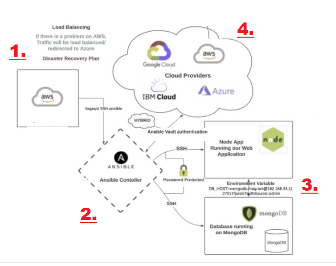

# What is Infrastructure as Code

Process of managing and provisioning infrastructure using code rather than doing it manually.

This covers processes such as file management, installations, creating instances and more.

Managing infrastructure manually is like manually packaging boxes, IaC is like doing this using a machine that automatically packages things.

# What is configuration management

This process can be part of an automation pipeline and speeds up deployment. Can even use programs such as Ansible to update instances or do other processes within them like changing config files or opening ports, provided the IPs and SSH credentials. This is called **configuration management**.

# What is orchestration

Orchestration is an aspect of IaC that focusses on managing and coordinating deployment automatically in multiple different systems at once. 

Essentially congifuration management but can be done on many instances over an entire ASG for example.

# Diagram of IaC setup

1. Master node for controlling/managing the others.
2. This is our controller in Ansible, we can SSH into this. 
3. These are our instances that Ansible connects to via SSH to do the configuration management, in this example this consists of one instance running the app using node and another running the database in mongodb. This is done automatically by Ansible as it is **agentless**.
4. Ansible vault. This is where we save the keys for all of our instances so Ansible can SSH into them, and can even connect to any number of cloud providers using this process. 