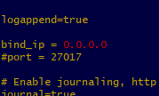

# Ansible

## Table of contents:

1. [Why use Ansible](#why-use-ansible)

2. [Setting up Ansible](#why-use-ansible)

3. [Connecting with Ansible](#connecting-with-ansible)

4. [What are playbooks and how do we use them?](#playbooks)

5. [Other useful playbooks](#other-useful-playbooks)

6. [Using playbooks for configuration](#using-playbooks-to-configure-files)

# Why use Ansible?

Ansible is a powerful tool that allows you to connect to, and control many different instances at once entirely from a single **controller instance** and remotely execute scripts using something called **playbooks**.

It is obvious why this is useful, not only can it be used to automate changes to config files/packages/files/etc, it also has the ability to do this to an entire network of instances, automatically, **by reading a list of IPs from it's 'hosts' file**. However, it's primary practical use is to install packages/edit configs necessary for a deployment.

In this repo, I will demonstrate how we used ansible to provision a pre-made two-tier VPC entirely from the controller. The app instance had ports 22 (SSH), 80 (HTTP) and 3000 (NodeJS) open, and the database had ports 22 (SSH) and 27017 (MongoDB) open, as standard for a two tier architecture like this. This is a diagram illustrating what our controller was able to do.


# Setting up Ansible

### This is a step by step process for how we installed and set up Ansible, we cover how we connected to instances using the controller later.

In this example we will be using an EC2 instance running Ansible as the controller, an instance running our node test app and a third instance with the database it relies on.

Setup steps for ansible:

1. We connected to our EC2 instance via SSH.

2. Then we input the following commands to update our packages and install Ansible...
```
# checks if ansible installed
ansible --version

#standard update/upgrade
sudo apt update -y
sudo apt upgrade -y

# extra step to ensure everything is up to date
sudo apt-get install software-properties-common

# sets up ansible for install
sudo apt-add-repository ppa:ansible/ansible

# installs ansible
sudo apt update -y
sudo apt install ansible -y
```

3. We opened another git bash terminal and typed `scp -i "<filepath to pem file needed to connect to controller>" <filepath to pem file needed by controller to connect to instances> ubuntu@<controller IP>:~/.ssh` to securely copy the AWS pem file to the Ansible controller so it can SSH into our instances.
- **Remember to `chmod400` your pem file in the controller instance so Ansible can read it!**

4. Optional: We installed tree to make working with files easier using `sudo apt install tree -y`

5. To ensure we installed everything correctly, we checked our Ansible version with `ansible --version` and recieved the expected result confirming the install was successful!


# Connecting with Ansible and testing connection with adhoc commands

Although we were able to use Ansible to connect to multiple different instances while **in** the Ansible controller by using ssh commands this is **not ideal**.

The purprose of Ansible is to **not** have to manually ssh into other instances in the network, so instead we **configured the controller to be able to read from a host file containing our instance IPs, and utilise something called playbooks provision them**. We will go over the playbooks themselves later.


1. We need to provide info about our agents in the hosts file.

- Hosts file is in the directory `/etc/ansible/` and we can edit it with nano.

2. We added the IP for both our application instance and our database instance at the bottom of the hosts file using the following format, with a **tag** then information about the instance associated with it below.

```
[app]
ec2-instance-app ansible_host=<IP> ansible_user=ubuntu ansible_ssh_private_key_file=/home/ubuntu/.ssh/<pem file>

[db]
ec2-instance-db ansible_host=<IP> ansible_user=ubuntu ansible_ssh_private_key_file=/home/ubuntu/.ssh/<pem file>
```
- `ec2-instance-<x>` Important that you put a name where x is or ansible will get confused about which instance to target, eg. app or db.

- `ansible_host` denotes the IP.

- `ansible_user=ubuntu` denotes the user we want to ssh as (eg. ubuntu rather than root).

- `ansible_ssh_private_key_file` denotes the location of the private key we need for ssh connections.

3. To test our connection we pinged our agent instance with the **adhoc command** `sudo ansible web -m ping` which returns an error if hosts not setup correctly.

We should see something like this if the ping was successful and we continued onto playbooks knowing we are able to connect to our instances.


**Adhocs** are useful for more than just testing a connection. You can use them to remotely execute a number of short commands for example, uname, date, etc using `sudo ansible <tag for instance in hosts> -a "<command to execute>"`.

They are short, simple commands that execute tasks used for testing/examining things and would therefore be inappropriate for a playbook.

Using an example, say if you wanted to power on all instances in Japan at 8am their time, you could use `sudo ansible web -a "date"` to check it's date/time for reference.

# Playbooks

Playbooks are a way to automate commands on the agents. These are functionally Ansible scripts written in **yaml** that will execute list of commands sequentially on the agent node.

**REMEMBER! Indentations in yaml use TWO SPACES not tab! They will not work if you use tab!**

**Additionally, yaml files require `---` at the start so the system knows to treat these as yaml files.**

An example of how you make these playbooks. We used this playbook to install **nginx** on the web server.

1. We used `sudo nano install-nginx.yml` lets to create a playbook file with nano.

2. Then we setup the steps for what we want to do using pseudocode.
```
# To create playbook to provision nginx web server in webnode
# Starts with 3 dashes
# Where to run/install?
# provide logs
# provide admin to this playbook
#instructions: install nginx
#ensure nginx is enabled
```

3. Then we wrote the commands out for each. Ansible uses a unique syntax where commands are instead seperated into **tasks** where you can define what you want the task to do.
```
# To create playbook to provision nginx web server in webnode
---
# Starts with 3 dashes
# Where to run/install?
- hosts: web

# provide logs
  gather_facts: yes

# provide superuser when executing this playbook
  become: true

#instructions: install nginx
  tasks:
  - name: provision nginx
    apt: pkg=nginx state=present

#ensure nginx is enabled
```

4. Then we ran the playbook using `sudo ansible-playbook install-nginx.yml` and we got an output like this, it shows that connection was ok and files were changed.


5. To confirm again the provision was successful, you can check nginx status using adhoc commands, `sudo ansible web -a "sudo systemctl status nginx"`.

# Other useful playbooks we used

**Remember, when reusing these for other projects change the 'hosts' variable in the playbook to the appropriate host in your case!**

The playbook we used to install nginx is provided in the section above, and the one to change config files is provided in the next section.

Blocker: If you get error `E:Malformed entry` then delete the offending file (it will be named in the error) on the agent. This is an error that can occur if the playbook isn't set up correctly and attempts to provision the agent.

We used this **playbook to delete files** to fix the malformed entry error:
```
---
- hosts: web
  gather_facts: yes
  become: true
  tasks:
  - name: Delete content & directory
    ansible.builtin.file:
      state: absent
      path: <path for offending file>
```
We ran this **update/upgrade all** playbook prior to any others to ensure all relevant packages were installed on the agents:
```
---
- hosts: all
  gather_facts: yes
  become: true
  tasks:
  - name: Update/upgrade
    apt:
      upgrade: yes
      update_cache: yes
```

We ran this playbook to **install nodeJS** on the web app instance after installing nginx:
```
---
- hosts: app
  gather_facts: yes
  become: true
  tasks:
  - name: install curl
    apt:
      name: curl
      state: present
  - name: get key
    shell: curl -sL https://deb.nodesource.com/setup_12.x | sudo -E bash
    args:
      warn: false
  - name: install nodejs
    apt:
      name: nodejs
      state: present
      update_cache: yes

```

And finally we used this to **install mongodb** on the database instance:
```
---
- hosts: db
  gather_facts: yes
  become: true
  tasks:
  - name: updatemongo
    apt: pkg=mongodb state=present
```

# Using playbooks to configure files

Playbooks aren't exclusively used for installations. We also used them to configure files.

As an example, we **configured the bindIP for MongoDB**, so it knows from which connections to accept requests for database information, and we also **added an environment variable to the app instance providing the database instance address** to allow us to send HTTP requests from the app, and retrieve database information as a response.

### Configuring the bindIP for MongoDB.

1. We created a new playbook with an appropriate name using `sudo nano mongodb-bindip.yml`.

2. We then wrote out the steps we need to edit the bindIP in the config file.
- We will use the **lineinfile** module for Ansible as this allows us to change a single line in a file, which is appropriate as we only need to change the bindIP line. This is line **12** of the config file.

```
---
- hosts: db
  gather_facts: yes
  become: true
  tasks:
  - name: Change mongodb bindIP
    ansible.builtin.lineinfile:
      path: /etc/mongodb.conf
      search_string: bind_ip = 127.0.0.1
      line: bind_ip = 0.0.0.0
  handlers:
  - name: restart mongodb
    service: name=mongodb state=restarted
```

- `path` = Destination of file being edited (filepath).
- `search_string` = String to search for in the file.
- `regexp` = Regular expression for the substitution we'll be doing. We won't use this here but it's useful to know.
- `line` = The line we will be inserting.
- Additionally, we want to include `handlers` at the bottom. This essentially restarts mongodb by selecting the service then changing state to restarted. We use handlers rather than tasks for this as it only restarts if required, and is best practice!

3. We then tested if the config worked correctly with adhocs that will print the contents of the config file: `sudo ansible db -a "sudo cat /etc/mongod.conf"` and saw that the bindIP had changed.



### Setting environment variables with playbooks during tasks

In the previous section we changed bindIP in the mongoDB config file. So, for our example for changing environment variables with playbooks, we changed **DB_HOST** environment variable in our app instance to `mongodb://<public IP for db instance>:27017/posts` then seeded the database.

However, **setting environment variables is done on a task by task basis**, as is **changing cwd**.

We used the **environment keyword** to set the environment variables for a given task. We need to do this when running the app, and when seeding the database as the database IP is needed for these tasks.
```
environment:
  DB_HOST: mongodb://34.252.133.230:27017/posts
```

Then to define the current working directory for a task, for npm install, seeding and running the app we used the **args keyword**.
```
args:
  chdir: ubuntu/home/app/app/
```

1. We created a new playbook with an appropriate name using `sudo nano mongodb-env-seed.yml`.

2. We then outlined the steps required to...
- Install the packages needed to run the app and seed the database.
- Seed the database.
- Kill any processes already running.
- Start the app.

```
---
- hosts: app
  gather_facts: yes
  become: true
  tasks:
    - name: Installs packages app depends on
      command: npm install
      args:
        chdir: ubuntu/home/app/app/
    - name: Seed the database
      command: node seeds/seed.js
      args:
        chdir: ubuntu/home/app/app/
      environment:
        DB_HOST: mongodb://34.252.133.230:27017/posts
    - name: Kill any running processes
      command: pm2 kill
    - name: Start the app
      command: pm2 start app.js
      args:
        chdir: ubuntu/home/app/app/
      environment:
        DB_HOST: mongodb://34.252.133.230:27017/posts
```

Now all of our infrastructure is set up. We can then create a bash script to run all of these playbooks sequentially and essentially provision the entire network in a single command!

We dont need app starting functionality in our actual playbook, as this can be handled by tools like **Jenkins**.