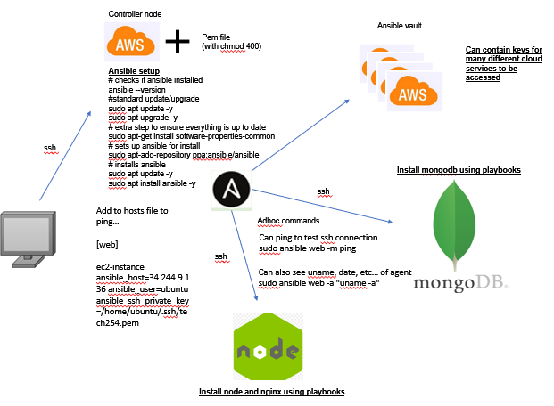
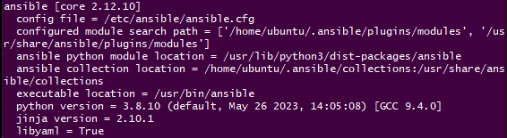
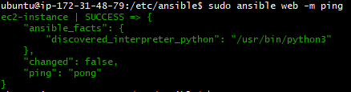
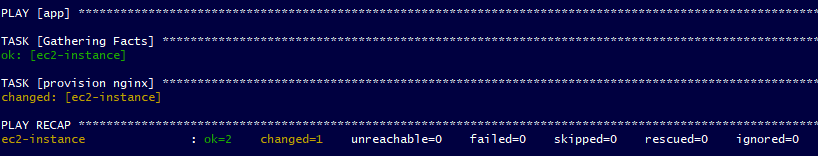
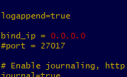

# Why use ansible?

Ansible is a powerful tool that allows you to connect to, and control many different instances at once and execute an automated list of commands using something called playbooks.

It is obvious why this is useful, not only can it be used to automate changes to config files/packages/files/etc, it also has the ability to do this to an entire web of servers automatically by reading a list of IPs from it's host file. However, it's primary practical use is to install packages/edit configs necessary for a deployment.

It has a range of other powerful uses, shown in the diagram below that illustrates the structure of an Ansible system.



# Setting up Ansible

This is a step by step process for setting up Ansible.

In this example we will be using an EC2 instance running ansible as the controller, an instance running node and a third instance with the database.

Setup steps for ansible:

1. Connect to your EC2 instance

2. Input the following commands...
```
# checks if ansible installed
ansible --version

#standard update/upgrade
sudo apt update -y
sudo apt upgrade -y

# extra step to ensure everything is up to date
sudo apt-get install software-properties-common

# sets up ansible for install
sudo apt-add-repository ppa:ansible/ansible

# installs ansible
sudo apt update -y
sudo apt install ansible -y
```

3. Open another git bash and type `scp -i "~/.ssh/tech254.pem" ~/.ssh/tech254.pem ubuntu@<instance IP>:~/.ssh` (change to include the IP of your instance) to provide Ansible with the AWS pem file so it can SSH into instances
- **Remember to `chmod400` your pem file!**

4. Optional step to install tree (just makes working with files easier) `sudo apt install tree -y`

5. Check Ansible version with `ansible --version` and we should see something like this, confirming the install was successful!



# Connecting with ansible

Can connect to other instances while IN the ansible instance by using standard ssh commands, referencing the .pem file.

1. We need to provide info about our agents in the hosts file.

Hosts file is in the directory `/etc/ansible/`

Then when in it, use `sudo nano hosts`

2. Can add IP for who you want to ping in hosts. Can add one for the db too!

```
[app]
ec2-instance-app ansible_host=<IP> ansible_user=ubuntu ansible_ssh_private_key_file=/home/ubuntu/.ssh/<pem file>
```
- `ec2-instance-<x>` Important that you put a name where x is or ansible will get confused about which instance to target, eg. app or db

- `ansible_host` denotes the IP

- `ansible_user=ubuntu` denotes the user we want to ssh as (eg. ubuntu rather than root)

- `ansible_ssh_private_key_file` denotes the location of the private key we need for ssh connections

3. To test our connection we can ping our agent instance with `sudo ansible web -m ping`which returns an error if hosts not setup correctly.

We should see something like this if the ping was successful



- Can also see uname, date, etc… of agent `sudo ansible web -a "uname -a"`

These short ansible commands like ping and the uname one are called **adhocs**.

The main advantage to these are that they are short, simple commands that execute tasks used for testing/examining things and would therefore be inappropriate for a playbook, something we will talk about next.

Using an example, say if you wanted to power on all instances in Japan at 8am their time, you could use `sudo ansible web -a "uname -a"` to check the name of the japanese server, then `sudo ansible web -a "date"` to check it's date/time.

# Playbooks

These are a way to automate commands on the agents. Functionally Ansible scripts that will execute list of commands sequentially on the agent node.

These are written in yaml and are a large reason why Ansible is so effective for automation.

**REMEMBER! Indentations in yaml use TWO SPACES not tab!**

An example of how you make these playbooks (playbook to install nginx)...

1. `sudo nano install-nginx.yml` lets you create a playbook file with nano

2. Then we can setup the steps for what we want to do with pseudocode
```
# To create playbook to provision nginx web server in webnode
# Starts with 3 dashes
# Where to run/install?
# provide logs
# provide admin to this playbook
#instructions: install nginx
#ensure nginx is enabled
```

3. Then write the commands out
```
# To create playbook to provision nginx web server in webnode
---
# Starts with 3 dashes
# Where to run/install?
- hosts: web

# provide logs
  gather_facts: yes

# provide admin to this playbook
  become: true

#instructions: install nginx
  tasks:
  - name: provision nginx
    apt: pkg=nginx state=present

#ensure nginx is enabled
```
- yaml files require `---` at the start so the system knows to treat these as yaml files

4. To run the playbook use `sudo ansible-playbook mongo-playbook.yml` and we should get an output like this, it shows that connection was ok and files were changed.



5. To confirm 100%, you can check the status using adhoc commands! Eg. in the case of mongo you can use `sudo ansible web -a "sudo systemctl status mongodb"`

# Other useful playbooks

**Remember to change the 'hosts' to the appropriate host in your case!**

Blocker: If you get error `E:Malformed entry` then delete the offending file (it will be named in the error) on the agent.

Playbook to do this:
```
---
- hosts: web
  gather_facts: yes
  become: true
  tasks:
  - name: Delete content & directory
    ansible.builtin.file:
      state: absent
      path: <path for offending file>
```
Update/upgrade all:
```
---
- hosts: all
  gather_facts: yes
  become: true
  tasks:
  - name: Update/upgrade
    apt:
      upgrade: yes
      update_cache: yes
```

Install nginx:
```
---
- hosts: web
  gather_facts: yes
  become: true
  tasks:
  - name: provision nginx
    apt: pkg=nginx state=present
```

Install nodeJS:
```
---
- hosts: app
  gather_facts: yes
  become: true
  tasks:
  - name: install curl
    apt:
      name: curl
      state: present
  - name: get key
    shell: curl -sL https://deb.nodesource.com/setup_12.x | sudo -E bash
    args:
      warn: false
  - name: install nodejs
    apt:
      name: nodejs
      state: present
      update_cache: yes

```

Install mongodb:
```
---
- hosts: db
  gather_facts: yes
  become: true
  tasks:
  - name: updatemongo
    apt: pkg=mongodb state=present
```

# Using playbooks to configure files

Playbooks aren't exclusively used for installations. We can also use them to configure files.

A good example of this is configuring the bindIP for mongoDB.

Pre-steps: Make sure to **make an instance for your mongoDB** that has ports **27017** and **22** open (for mongo and ssh respectively) and **install mongoDB** (the playbook for this is listed in the useful playbooks section of this document).

1. Create a new playbook with an appropriate name. `sudo nano mongodb-bindip.yml` will suffice.

2. Codify the steps we need to edit the bindIP in the config file.
- We will use the **lineinfile** module for ansible as this allows us to change a single line in a file, which is appropriate as we only need to change the bindIP line. This is line **12** of the config file.
- We also want `become: true` since we will need to execute this as superuser.
- `path` = Destination of file being edited (filepath).
- `search_string` = String to search for in the file.
- `regexp` = Regular expression for the substitution we'll be doing. We won't use this here but it's useful to know.
- `line` = The line we will be inserting.
- More info on module here: https://docs.ansible.com/ansible/latest/collections/ansible/builtin/lineinfile_module.html

3. Additionally, we want to include `handlers` at the bottom. This essentially restarts mongodb by selecting the service then changing state to restarted. We use handlers rather than tasks for this as it only restarts if required, and is best practice!

```
---
- hosts: db
  gather_facts: yes
  become: true
  tasks:
  - name: Change mongodb bindIP
    ansible.builtin.lineinfile:
      path: /etc/mongodb.conf
      search_string: bind_ip = 127.0.0.1
      line: bind_ip = 0.0.0.0
  handlers:
  - name: restart mongodb
    service: name=mongodb state=restarted
```

4. You can test if the config worked correctly with adhocs that will print the contents of the config file: `sudo ansible db -a "sudo cat /etc/mongod.conf"` and we should see that the bindIP has changed.
- db is the name of our database instance in the hosts file



# How to change environment variables with playbooks

In the previous section we changed bindIP in the mongoDB config file. So, for our example for changing environment variables with playbooks, we will change **DB_HOST** environment variable in our app instance to `mongodb://<public IP for db instance>:27017/posts` then seed the database.

1. Create a new playbook with an appropriate name. `sudo nano mongodb-env-seed.yml` will suffice.

2. Codify the steps we need to change an environment variable. We will be using the **environment** keyword for this.
- We also want `become: true` since we will need to execute this as superuser.

```
---
- hosts: app
  gather_facts: yes
  become: true
  tasks:
    - name: Set environment var
      environment:
        DB_HOST: mongodb://34.252.133.230:27017/posts
    - name: Seed db
      command: node seeds/seed.js
  handlers:
    - name: restart nginx
      service: name=nginx state=restarted
```

3. To permanently set an environment variable, use `lineinfile` in the same way as shown in the mongo bindIP config file change, but on the file `/home/ubuntu/.bashrc` and add the line `DB_HOST: mongodb://34.252.133.230:27017/`. We will need to do this if **we're setting up the app instance for deployment of our actual app**.
- `line: ''` inserts at the bottom of the file

---
- hosts: app
  gather_facts: yes
  become: true
  tasks:
  - name: Change mongodb bindIP
    ansible.builtin.lineinfile:
      path: /home/ubuntu/.bashrc
      search_string: bind_ip = DB_HOST: mongodb://34.252.133.230:27017/
      line: ''
  handlers:
  - name: restart mongodb
    service: name=mongodb state=restarted
```

To start app:

sudo ansible app -a "pm2 start /home/ubuntu/app/app/app.js"

We dont need app starting functionality in our actual playbook, as this will be handled by tools like **Jenkins**.