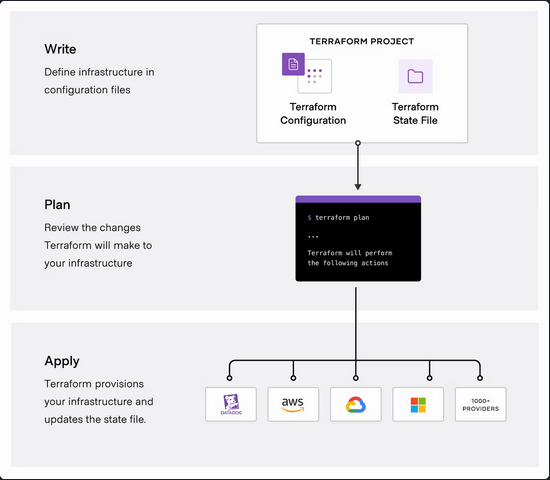
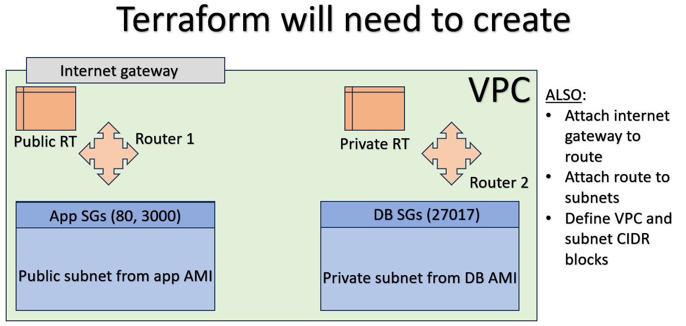

# Why orchestration
Orchestration is essentially the practice of coordinating many processes in development at the same time.

Coordinating multiple processes at once automatically helps complete a range of tasks all at the same time, saving time.

# Why terraform
Terraform allows you to make many changes to configuration/deployment across a range of different cloud providers all at the same time, esentially completing a task that would take days or weeks, all at once.

Terraform specifically lets you plan your changes to infrastructure then review these before deploying them.

Additionally, you only need to define how you want your infrastructure to look in the end using your config files, so dont need to define a laborious step by step process.

# How to do orchestration with terraform



Orcehstration with Terraform is a 3 step process. 

This first involves defining your infrastructure such as contents of configuration files. 

Then reviewing the changes to make sure the actions performed are to your specifications.

And finally, applying these changes across a range of different instances and cloud providers.

# How to use terraform

Terraform uses files marked with the .tf file format to execute it's commands.

1. To begin we open GitBash (as admin) and create `main.tf` with nano.

2. In this file we add the following to download the resources to use terraform with our given provider:

```
# Name of our provider (eg. "aws")
provider "<name>" {
    # Region we want our instances located in within our provider
    region = "<region>"
}
```
- The syntax for Terraform is extremely simple and primarily consists of variable names, and their associated information in quotation marks. These are all contained within curly brackets denoting what exactly we're creating.

3. We then save this, and run it using `terraform init`, which will download all the resources we need.

4. We can then add more to `main.tf` based on the provider we gave. In the case of an AWS EC2 instance, this would look like this.

```
# Give the name here and say that we want an instance (vs say, a VPC for example)
resource "aws_instance" "<name>" {
    # Define the AMI here
    ami = "<ami ID>"

    # The type of the instance, (eg. t2.micro, etc...)
    instance_type = "<type here>"

    # Any tags we want to help with searching for our instance 
    tags = {
        # For example, the name
        Name = "<name>"
    }
}
```

5. With this we can run `terraform plan` which will list the changes that will be made, it's worth reading these before going to the next step so we know exactly what we'll be doing.

6. Then we can run `terraform apply` to make those changes.

7. Finally, once we're done with our instance, `terraform destroy` will terminate it.

The advantage of this is that the entire process of creating and terminating instances can be fully automated, saving time and therefore money.

Provisioning is then passed onto Ansible typically.

# Using variable.tf

Instead of defining the attributes of our instances in main.tf, which can be a security flaw if you were to upload these to GitHub. We can instead make use of a variable file.

You do this by creating a new file called `variable.tf` then in this you define variables to call in main.tf using `var.<variable name>`.

For example:

variable.tf
```
variable "aws-region" {
    default = "<region here>"
}
```

main.tf
```
provider "aws" {
	region = var.aws-region
}
```

This functionally works the same as .env files in HTML/JS.

# Setting up a VPC with Terraform

To do this, Terraform will need to execute the following tasks to create what is pictured here:



1. First we define the region and provider, as usual.

```
provider "<name>" {
    region = <region var>
}
```

2. To actually create the **VPC** we tell Terraform we want a VPC and what we want to name it. We can also include the `cidr_block` here.

```
resource "aws_vpc" "<name>" {
  cidr_block = <put CIDR var here>

  tags = {
    Name = "<name>"
  }
}
```

3. Then we create the **subnet**. This is done in a similar way to the VPC, with you needing to define the `cidr_block`, but also the `vpc_id` which is the VPC we will attach this subnet to. We also need to define `map_public_ip_on_launch` as this tells terraform to assign a public IP or not, and the `availability_zone` in which the subnet resides. **We need to do this TWICE!**

```
resource "aws_subnet" "<name>" {
  vpc_id     = <put VPC ID var here>
  cidr_block = <put CIDR var here, within VPC range>
  map_public_ip_on_launch = <put var for true/false here>
  availability_zone = <az var here>

  tags = {
    Name = "<name>"
  }
}
```

4. Then we make the **internet gateway**. This is fairly standard as we only need the `vpc_id`, which automatically attaches this to our VPC.

```
resource "aws_internet_gateway" "<name>" {
    vpc_id = <vpc ID var>

    tags {
        Name = "<name>"
    }
}
```

5. Create **public route table**, the private subnet uses the default route table like when we created a VPC manually. We define the `vpc_id` to attach to and the `route` to our `gateway_id` (internet gateway).

```
resource "aws_route_table" "<name>" {
    vpc_id = <vpc ID var>
    
    route {
        cidr_block = <var that defines 0.0.0.0/0, allowing all connections>
        gateway_id = <IG ID var>
    }
    
    tags {
        Name = "<name>"
    }
}
```

6. Then we **associate the public subnet with our public RT** using `subnet_id` and `route_table_id` within the `aws_route_table_association` resource.

```
resource "aws_route_table_association" "<name>"{
    subnet_id = <var with ID for public subnet>
    route_table_id = <var with public RT ID>
}
```

7. We also need to create the **security groups** seperately, for **BOTH** private and public subnets. We need to define each port in the security groups **seperately**, with `egress` which is the IPs to accept for a connection, and `ingress` which is the port that is open to connections. We can leave the protocol as **-1** and **TCP**, respectively, in most cases.

```
resource "aws_security_group" "<name>" {
    vpc_id = <var for VPC ID>
    
    egress {
        from_port = 0
        to_port = 0
        protocol = "-1"
        cidr_blocks = [<var for accepted connections>]
    }    
    
    ingress {
        from_port = 22
        to_port = 22
        protocol = "tcp"
        cidr_blocks = [<var for accepted connections>]
    }

    # Add more below!
}
```

8. Then we create the two instances like we did in the example earlier in the doc! Though, we do need to define `subnet_id` here too unlike before.